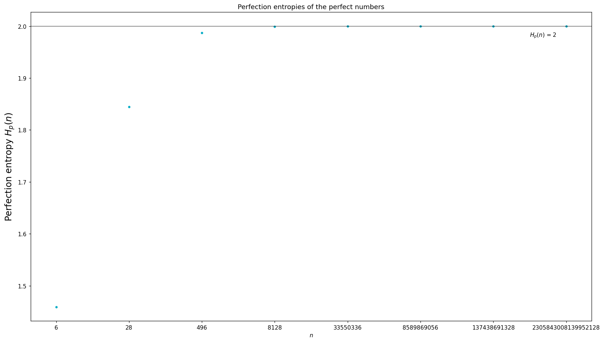

# Project Overview

This project explores the structure of perfect and pseudoperfect numbers as quantified by novel definition of entropy that is defined in terms of the divisors of these numbers. The main goal is to investigate whether entropy provides insights into the existence of odd perfect numbers—a long-standing unsolved problem in mathematics.
[A more detailed overview can be found here](https://github.com/Dank-o/Perfection_Entropy/blob/main/detailed_overview.ipynb).

**Key Concepts**

Perfect Number: A number whose divisors (excluding itself) sum to the number itself. For example, 28 = 1 + 2 + 4 + 7 + 14. Perfect numbers are a special case of pseudoperfect numbers.

Pseudoperfect Number: A broader category where some subset of divisors sums to the number. e.g, 12 = 1 + 2 + 3 + 6.

Primitive Pseudoperfect Number: A pseudoperfect number that is not divisible by other pseudoperfect numbers.

Perfection Entropy: A metric I created that characterises a pseudoperfect number based on a subset of the divisors that sum to the number.

**Empirical Findings**

The perfection entropy of odd pseudoperfect numbers is observed to be higher than that of even pseudoperfect numbers, separated by a boundary at approximately 2.55. (Figure 1)

The known perfect numbers exhibit a converging pattern of entropy values, suggesting potential links between perfection entropy and number classification. (Figure 2)

**Visualisations**

    
    
<em>Figure 1: A chart showing the perfection entropies of the primitive pseudoperfect numbers with their parity and the perfect numbers indicated.</em>

    
    
<em>Figure 2: A chart showing the perfection entropies of the first 8 perfect numbers suggesting an asymptotic value of 2.</em>

</div

**Requirements**

Python 3.x

Required libraries: matplotlib, numpy, matplotlib, colorcet
